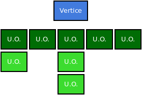
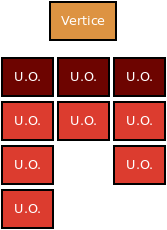
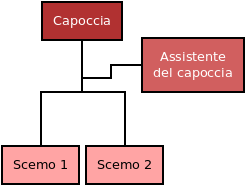
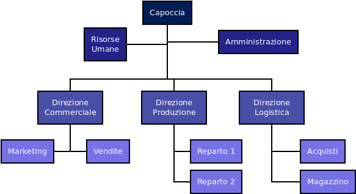
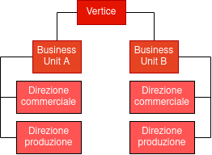
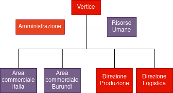

# G P O I

## Indice

- U1
	- **L1** *2* Informazione e l'organizzazione
	- **L2** *13* Micro e macrostruttura
	- **L3** *26* Le strutture organizzative
	- **L4** *37* I costi di un'organizzazione aziendale
- U2
	- **L1** *46* Catena del valore, processi primari e processi di supporto
	- **L2** *60* Le prestazioni dei processi aziendali
	- **L3** *66* Modellizzazione dei processi aziendali e principi della gestione per processi
- U4
	- **L1** *112* Il progetto e le sue fasi
	- **L2** *117* Il principio di chiave nella gestione di un progetto e gli obiettivi di progetto
	- **L3** *125* L'organizzazione dei progetti
	- **L4** *142* Tecniche di pianificazione e controllo temporale
	- **L5** *156* La programmazione e il controllo dei costi e la gestione della aree di rischio
	- **L6** *167* Pianificazione e controllo della qualità e gestione della documentazione
- U5
	- **L1** *174* I progetti informatici
	- **L1** *183* Il processo di produzione del software
	- **L3** *191* Preprogetto: fattibilità e analisi dei requisiti
	- **L4** *206* Preprogetto: pianificazione del progetto
	- **L5** *219* Le metriche del software

## U1

### **L1** - Informazione e l'organizzazione
#### L'informazione come risorsa organizzativa

La classificazione delle tencologie informatiche è fatta basandosi sull'utilizzo che se ne fa:

- di automazione: linea di produzione automatizzata
- di supporto alle decisioni: gestione del processo produttivo del prodotto
- embedded: parte dei prodotti fortini dall'organizzazione
- infrastrutturali: tecnologie inter-organizzative utilizzate per la gestione degli scambi informativi tra organizzazioni diverse

L'impresa è un sistema dinamico, è definita come l'attività svolta dall'imprenditore, l'azienda è l'insieme di beni organizzati per svolgere l'attività preposta. "Chi fa che cosa" si chiama specializzazione del lavoro verticale.

#### Elementi di organizzazione
##### Specializzazione del lavoro verticale/orizzontale

- **Specializzazione Verticale**: La suddivisione fra chi progetta e chi produce è verticale, il responsabile organizza i sottoposti, i "livelli" più bassi eseguono. Per ridurre la specializzazione verticale si usa il *job enrichment*: arricchimento delle mansioni, aumento dell'autonomia decisionale, minore distinzione tra chi decide e chi esegue.
- **Specializzazione Orizzontale**: Chiamata anche parcellizzazione del lavoro, poche semplici attività a tutti i lavoratori. Come una catena di montaggio. Per ridurre la specializzazione orizzontale si usa il *job enlargement*: allargamento delle mansioni per contrastare la monotonia, al lavoratore vengono afffidate più attività tra loro collegate e non una singola operazione.

#### Meccanismi di coordinamento
##### Ex Post, Ex Ante

Due categorie:

- **Ex-Post**: non si cura degli imprevisti e li si risolve quando si presentano
	- *Adattamento reciproco* o (mutuo adattamento): meccanismo più informale, le persone si parlano allo stesso livello
	- *Supervisione diretta*: qando l'adattamento reciproco non funziona
- **Ex-Ante**: prevede metodi di risoluzione degli imprevisti
	- *Standardizzazione dei processi*: si cerca di uniformare il modo di fare il lavoro
	- *Standardizzazione dei risultati*: si rende uniforme il "cosa fare", non importa come, ma i risultati che si ottengono
	- *Standardizzazione delle competenze*: gli operatori sono in grado di svolgere un assegnazione sulla base di conoscenze standardizzate attraverso la formazione richiesta per eseguire il lavoro

### **L2** - Micro e macrostruttura
#### La posizione individuale e la mansione
##### Microstruttura, Mansionario

La **microstruttura** si occupa delle posizione lavorative dei singoli. È rappresentata nel **mansionario**, una raccolta dei compiti previsti per ogni mansione.

Al concetto di *posizione individuale* si aggancia quello di *mansione*, a sua volta definito attraverso la nozione di *compito*. La posizione individuale è la propria posizione lavorativa, il compito è un insieme di attvità intrinsecamente collegate e inscindibili. La mansione è un insieme di compiti e ci possono essere più persone con la stessa mansione. Il ruolo è associato non al "cosa fare" ma al "come fare".

- Quanti compiti: grado di specializzazione orizzontale
- Grado di autonomia: grado di specializzazione verticale

I compiti sono legati da interdipendenze, possono essere: 
- sequenziali (catena di ontaggio, produzione in linea)
- reciproche (il prodotto si sposta tra reparti anche se ci è già stato)
- legate alle risorse (due compiti condividono le stesse risorse)
- spazio-temporali (i compiti anche se non interagiscono vengono eseguiti nello stesso luogo/momento)

> La **mansione** si svolge, la **posizione** si ricopre, il **ruolo** si interpreta.

La *progettazione organizzativa* della microstruttura consiste nel definire il contenuto del lavoro dei singoli individui all'interno dell'organizzazione.

#### Le unità organizzative
##### Macrostruttura, organigramma, span of control orizzontale, gerarchia verticale

La **macrostruttura** comprende l'aggregazione degli individui, raggruppati secondo criteri di unità organizzative, cioè strutture relativamente autonome costituite da un insieme di persone che svolgono attività fra loro collegate. È rappresentata dall'**organigramma**, una rappresentazione grafica delle unità organizzative.

Una delle scelte fonamentali della progettazione organizzativa a livello macrostrutturale riguarda la detemrinazione del numero di persone che dipendono da un capo, ovvero la dimensione dell'unità organizzativa, questo concetto prende il nome di *ampiezza del controllo* (*span of control*) inteso come il numero di persone direttamente dipendenti da un capo.

L'ampiezza di controllo fornisce una misura cosiddetta *orizzontale* dell'organizzazione, tante unità che dipendono direttamente dal vertice e poche unità subordinate ai vari livelli gerarchici.

Una seconda dimensione caratteristica dell'organizzazione è quella *verticale*, espressa dalla catena gerarchica. Il temrine *gerarchia* sta a indicare la relazione di subordinazione che può esistere tra due posizioni

> La **gerarchia** esprime la progressiva specificazione degli obiettivi generali dell'impresa in sotto-obiettivi specifici delle diverse unità organizzative che la costituiscono

La linea gerarchica si rifà al principio di unicità del comando di Fayol, ogni individuo e unità organizzativa deve ricevere ordini da un solo superiore.

> **Ampiezza del controllo** e **lunghezza della catena gerarchica** sono due dimensioni tra loro interrelate: se ogni capo supervisiona un numero limitato di persone, il numero dei capi necessari è maggiore in ciascun livello gerarchico, fino a richiedere l'introduzione di ulteriori livelli gerarchici per controllare i supervisori.

|Strutture organizzative orizzontali|Strutture organizzative verticali|
|:---|:---|
|**Larghe**: elevata ampiezza del controllo|**Strette**: limitata ampiezza del controllo|
|**Corte**: linea gerarchica breve|**Larghe**: linea gerarchica lunga|

#### Linea e staff

Le unità organizzative possono essere:

- **Organi di linea**: quelli che si collocano lungo la linea gerarchica cioè occupano dell'attività centrale di un'azienda (come le unità di progettazione, produzione e vendita)
- **Organi di staff**: non si collocano direttamente sulla linea gerarchica, ma affiancano gli organi di linea a diversi livelli per supportare le attività. Realizzano servizi a supporto dell'operatività dell'azienda, senza partecipare al flusso principale del processo produttivo o di erogazione dei servizi. È un trend recente quello dell'*outsourcing dei processi di supporto*, overro l'affidamento di queste attività a società esterne che si occupano solo di quello.

#### Criteri di raggruppamento

A livello di macrostruttura (organigramma) si raggruppano attività che vengono associate a unità organizzative, a livello di microstruttura (mansionario) si raggruppano compiti che vanno associati a posizioni individuali.

I criteri di raggruppamento delle unità organizzative appartengono a tre categorie:

- criteri di raggruppamento **numerico**
- criteri di raggruppamento **orientati agli input**
- criteri di raggruppamento **orientati agli output**

##### Criterio di raggruppamento numerico

Le unità organizzative vengono create dividendo i lavoratori in gruppi di dimensione adeguata per essere gestiti e coordinati da un unico capo

##### Criterio di raggruppamento orientato agli input

- Raggruppamento in base alle **conoscenze e capacità**: come i reparti di un ospedale, suddivisi secondo la loro unica specialità
- Raggruppamento in base alla **funzione svolta o alla tecnica o processo di lavoro**: l'applicazione di questo criterio genera la creazione delle funzioni aziendali (produzione, marketing, amministrazione ecc.) o dei reparti produttivi (per una realtà produttiva, per esempio, tornitura, fresatura, saldatura ecc.)

##### Criterio di raggruppamento orientato agli output

- Raggruppamento in base al **prodotto**: un azienda multi prodotto può essere organizzata per linee di prodotto
- Raggruppamento in base al **cliente**: si distinguono i piccoli clienti dai grandi, come nel caso delle banche
- Raggruppamento in base all'**area geografica**: le U.O. raggruppano le attività svolte in un'unica area geografica, come nel caso delle filiali di un'azienda multimediale

### **L3** - Le strutture organizzative (composte da Unità organizzative)
#### La struttura semplice
##### è semplice, è nel nome

È la struttura organizzativa più elementare, costituita da poche unità organizzative, coordinate prevalentemente attraverso la gerarchia. Il livello di formalizzazione è basso, non esistono descrizioni di procedure, mansionari e talvolta, neppure l'organigramma

Come su può vedere dal diagramma: la struttura **semplice**, è *semplice*.

#### La struttura funzionale
##### Evoluzione della semplice

È l'evoluzione più comune dell'organizzazione semplice (si ottiene facendo evolvere la struttura semplice utilizzando una Pietralunare). In una struttura funzionale le unità organizzative al primo livello gerarchico (le più vicine al vertice) sono progettate raggruppando le attività in base allo svolgimento di una funzione comune, secondo il criterio di raggruppamento orientato agli input.

Vantaggio: economia di scala
Svantaggio: mancanza di focus su specifici prodotti, clienti e mercati

#### La struttura divisionale
##### Sopperisce alle mancanze della funzionale

La forma divisionale risponde ai limiti della struttura funzionale seguendo i criteri di raggruppamento orientati agli output. Le unità di primo livello sono create con cirteri alternativamente di prodotto, di cliente, di area geografica. Queste unità organizzative vengono dette divisioni o business unit.

#### La struttura ibrida
##### Un p0' di funzionale e di divisionale

Per la definizione di unità organizzative al primo livello gerarchico utilizza diversi criteri di raggruppamento, sia in base all'output che in base all'input

