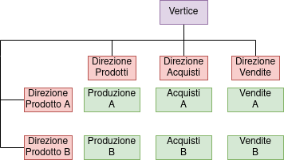
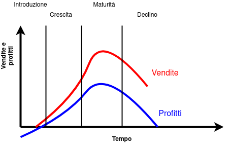
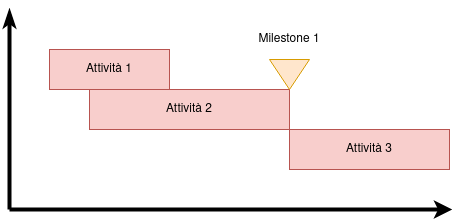

# G P O I

## Indice

<small>Ogni titoletto è un link per andare alla sezione corrispondente, cliccando poi il nome della sezione (nel documento, non nell'indice) porta all'indice</small>

- <a href="#U1">U1 - Elementi di economia e organizzazione aziendale</a>
	- <a href="#U1L1">**L1** *2* Informazione e l'organizzazione</a>
	- <a href="#U1L2">**L2** *13* Micro e macrostruttura</a>
	- <a href="#U1L3">**L3** *26* Le strutture organizzative</a>
	- <a href="#U1L4">**L4** *37* I costi di un'organizzazione aziendale</a>
- <a href="#U2">U2 - I processi aziendali</a>
	- <a href="#U2L1">**L1** *46* Catena del valore, processi primari e processi di supporto</a>
	- <a href="#U2L2">**L2** *60* Le prestazioni dei processi aziendali</a>
- <a href="#U4">U4 - Pricipi e tecniche di Project Management</a>
	- <a href="#U4L1">**L1** *112* Il progetto e le sue fasi</a>
	- <a href="#U4L2">**L2** *117* Il principio di chiave nella gestione di un progetto e gli obiettivi di progetto</a>
	- <a href="#U4L3">**L3** *125* L'organizzazione dei progetti</a>
	- <a href="#U4L4">**L4** *142* Tecniche di pianificazione e controllo temporale</a>
	- <a href="#U4L5">**L5** *156* La programmazione e il controllo dei costi e la gestione della aree di rischio</a>
- <a href="#U5">U5 - Gestione di progetti informatici</a>
	- <a href="#U5L1">**L1** *174* I progetti informatici</a>
	- <a href="#U5L2">**L1** *183* Il processo di produzione del software</a>
	- <a href="#U5L3">**L3** *191* Preprogetto: fattibilità e analisi dei requisiti</a>
	- <a href="#U5L4">**L4** *206* Preprogetto: pianificazione del progetto</a>
	- <a href="#U5L5">**L5** *219* Le metriche del software</a>

## <a href="#indice" id="U1">U1 - Elementi di economia e organizzazione aziendale</a>

### <a href="#indice" id="U1L1">L1 - Informazione e l'organizzazione</a>
#### L'informazione come risorsa organizzativa

La classificazione delle tencologie informatiche è fatta basandosi sull'utilizzo che se ne fa:

- di automazione: linea di produzione automatizzata
- di supporto alle decisioni: gestione del processo produttivo del prodotto
- embedded: parte dei prodotti fortini dall'organizzazione
- infrastrutturali: tecnologie inter-organizzative utilizzate per la gestione degli scambi informativi tra organizzazioni diverse

L'impresa è un sistema dinamico, è definita come l'attività svolta dall'imprenditore, l'azienda è l'insieme di beni organizzati per svolgere l'attività preposta. "Chi fa che cosa" si chiama specializzazione del lavoro verticale.

#### Elementi di organizzazione
##### Specializzazione del lavoro verticale (ernichment) / orizzontale (enlargement)

- **Specializzazione Verticale**: La suddivisione fra chi progetta e chi produce è verticale, il responsabile organizza i sottoposti, i "livelli" più bassi eseguono. Per ridurre la specializzazione verticale si usa il *job enrichment*: arricchimento delle mansioni, aumento dell'autonomia decisionale, minore distinzione tra chi decide e chi esegue.
- **Specializzazione Orizzontale**: Chiamata anche parcellizzazione del lavoro, poche semplici attività a tutti i lavoratori. Come una catena di montaggio. Per ridurre la specializzazione orizzontale si usa il *job enlargement*: allargamento delle mansioni per contrastare la monotonia, al lavoratore vengono afffidate più attività tra loro collegate e non una singola operazione.

#### Meccanismi di coordinamento
##### Ex Post (adattamento reciproco, supervisione) / Ex Ante (standardizzazione di processi, risultati, competenze)

Due categorie:

- **Ex-Post**: non si cura degli imprevisti e li si risolve quando si presentano
	- *Adattamento reciproco* o (mutuo adattamento): meccanismo più informale, le persone si parlano allo stesso livello
	- *Supervisione diretta*: qando l'adattamento reciproco non funziona
- **Ex-Ante**: prevede metodi di risoluzione degli imprevisti
	- *Standardizzazione dei processi*: si cerca di uniformare il modo di fare il lavoro
	- *Standardizzazione dei risultati*: si rende uniforme il "cosa fare", non importa come, ma i risultati che si ottengono
	- *Standardizzazione delle competenze*: gli operatori sono in grado di svolgere un assegnazione sulla base di conoscenze standardizzate attraverso la formazione richiesta per eseguire il lavoro

### <a href="#indice" id="U1L2">L2 - Micro e macrostruttura</a>
#### La posizione individuale e la mansione
##### Microstruttura, definita dal mansionario

La **microstruttura** si occupa delle posizione lavorative dei singoli. È rappresentata nel **mansionario**, una raccolta dei compiti previsti per ogni mansione.

Al concetto di *posizione individuale* si aggancia quello di *mansione*, a sua volta definito attraverso la nozione di *compito*. La posizione individuale è la propria posizione lavorativa, il compito è un insieme di attvità intrinsecamente collegate e inscindibili. La mansione è un insieme di compiti e ci possono essere più persone con la stessa mansione. Il ruolo è associato non al "cosa fare" ma al "come fare".

- Quanti compiti: grado di specializzazione orizzontale
- Grado di autonomia: grado di specializzazione verticale

I compiti sono legati da interdipendenze, possono essere:

- sequenziali (catena di montaggio, produzione in linea)
- reciproche (il prodotto si sposta tra reparti anche se ci è già stato)
- legate alle risorse (due compiti condividono le stesse risorse)
- spazio-temporali (i compiti anche se non interagiscono vengono eseguiti nello stesso luogo/momento)

> La **mansione** si svolge, la **posizione** si ricopre, il **ruolo** si interpreta.

La *progettazione organizzativa* della microstruttura consiste nel definire il contenuto del lavoro dei singoli individui all'interno dell'organizzazione.

#### Le unità organizzative
##### Macrostruttura definita dall'organigramma, span of control orizzontale, gerarchia verticale

La **macrostruttura** comprende l'aggregazione degli individui, raggruppati secondo criteri di unità organizzative, cioè strutture relativamente autonome costituite da un insieme di persone che svolgono attività fra loro collegate. È rappresentata dall'**organigramma**, una rappresentazione grafica delle unità organizzative.

Una delle scelte fonamentali della progettazione organizzativa a livello macrostrutturale riguarda la detemrinazione del numero di persone che dipendono da un capo, ovvero la dimensione dell'unità organizzativa, questo concetto prende il nome di *ampiezza del controllo* (*span of control*).

L'ampiezza di controllo fornisce una misura cosiddetta *orizzontale* dell'organizzazione, tante unità che dipendono direttamente dal vertice e poche unità subordinate ai vari livelli gerarchici.

Una seconda dimensione caratteristica dell'organizzazione è quella *verticale*, espressa dalla catena gerarchica. Il termine *gerarchia* sta a indicare la relazione di subordinazione che può esistere tra due posizioni

> La **gerarchia** esprime la progressiva specificazione degli obiettivi generali dell'impresa in sotto-obiettivi specifici delle diverse unità organizzative che la costituiscono

La linea gerarchica si rifà al principio di unicità del comando di Fayol, ogni individuo e unità organizzativa deve ricevere ordini da un solo superiore.

> **Ampiezza del controllo** e **lunghezza della catena gerarchica** sono due dimensioni tra loro interrelate: se ogni capo supervisiona un numero limitato di persone, il numero dei capi necessari è maggiore in ciascun livello gerarchico, fino a richiedere l'introduzione di ulteriori livelli gerarchici per controllare i supervisori.

|Strutture organizzative orizzontali|Strutture organizzative verticali|
|:---|:---|
|**Larghe**: elevata ampiezza del controllo|**Strette**: limitata ampiezza del controllo|
|**Corte**: linea gerarchica breve|**Larghe**: linea gerarchica lunga|

#### Linea e staff
##### Linea: produzione diretta | Staff: di supporto a quelli di linea

Le unità organizzative possono essere:

- **Organi di linea**: quelli che si collocano lungo la linea gerarchica cioè occupano dell'attività centrale di un'azienda (come le unità di progettazione, produzione e vendita)
- **Organi di staff**: non si collocano direttamente sulla linea gerarchica, ma affiancano gli organi di linea a diversi livelli per supportare le attività. Realizzano servizi a supporto dell'operatività dell'azienda, senza partecipare al flusso principale del processo produttivo o di erogazione dei servizi. È un trend recente quello dell'*outsourcing dei processi di supporto*, overro l'affidamento di queste attività a società esterne che si occupano solo di quello.

#### Criteri di raggruppamento
##### Numerico: numero adeguato di persone | Orientato agli input: in base a conoscenze o funzione svolta | Orientato agli output: in base a prodotto da realizzare, cliente trattato, area geografica coperta

A livello di macrostruttura (organigramma) si raggruppano attività che vengono associate a unità organizzative, a livello di microstruttura (mansionario) si raggruppano compiti che vanno associati a posizioni individuali.

I criteri di raggruppamento delle unità organizzative appartengono a tre categorie:

- criteri di raggruppamento **numerico**
- criteri di raggruppamento **orientati agli input**
- criteri di raggruppamento **orientati agli output**

##### Criterio di raggruppamento numerico

Le unità organizzative vengono create dividendo i lavoratori in gruppi di dimensione adeguata per essere gestiti e coordinati da un unico capo

##### Criterio di raggruppamento orientato agli input

- Raggruppamento in base alle **conoscenze e capacità**: come i reparti di un ospedale, suddivisi secondo la loro unica specialità
- Raggruppamento in base alla **funzione svolta o alla tecnica o processo di lavoro**: l'applicazione di questo criterio genera la creazione delle funzioni aziendali (produzione, marketing, amministrazione ecc.) o dei reparti produttivi (per una realtà produttiva, per esempio, tornitura, fresatura, saldatura ecc.)

##### Criterio di raggruppamento orientato agli output

- Raggruppamento in base al **prodotto**: un azienda multi prodotto può essere organizzata per linee di prodotto
- Raggruppamento in base al **cliente**: si distinguono i piccoli clienti dai grandi, come nel caso delle banche
- Raggruppamento in base all'**area geografica**: le U.O. raggruppano le attività svolte in un'unica area geografica, come nel caso delle filiali di un'azienda multimediale

### <a href="#indice" id="U1L3">L3 - Le strutture organizzative (composte da Unità organizzative)</a>
#### La struttura semplice
##### è semplice, è nel nome

È la struttura organizzativa più elementare, costituita da poche unità organizzative, coordinate prevalentemente attraverso la gerarchia. Il livello di formalizzazione è basso, non esistono descrizioni di procedure, mansionari e talvolta, neppure l'organigramma

Come su può vedere dal diagramma: la struttura **semplice**, è *semplice*.

#### La struttura funzionale
##### Evoluzione della semplice, orientata agli input

È l'evoluzione più comune dell'organizzazione semplice (si ottiene facendo evolvere la struttura semplice utilizzando una Pietralunare). In una struttura funzionale le unità organizzative al primo livello gerarchico (le più vicine al vertice) sono progettate raggruppando le attività in base allo svolgimento di una funzione comune, secondo il criterio di raggruppamento orientato agli input.

- Vantaggio: economia di scala
- Svantaggio: mancanza di focus su specifici prodotti, clienti e mercati (mancanza di orientamento agli output)

#### La struttura divisionale
##### Sopperisce alle mancanze della funzionale, orientata agli output

La forma divisionale risponde ai limiti della struttura funzionale seguendo i criteri di raggruppamento orientati agli output. Le unità di primo livello sono create con cirteri alternativamente di prodotto, di cliente, di area geografica. Queste unità organizzative vengono dette divisioni o business unit.

#### La struttura ibrida
##### Usa criteri di raggruppamento in base a output e input

Per la definizione di unità organizzative al primo livello gerarchico utilizza diversi criteri di raggruppamento, sia in base all'output che in base all'input

#### La struttura a matrice
##### Un po' di funzionale e di divisionale, unicità del comando non rispettata

In questa struttura le risorse fanno capo a più persone, questa organizzazione viola il principio di unicità del comando di Fayol

### <a href="#indice" id="U1L4">L4 - I costi di un'organizzazione aziendale</a>
#### Le tipologie di costo
##### Poche spese tanto guadagno

I risultati di un unità organizzativa dipendono dalle risorse che l'unità utlizza (concettualmente, i **costi**) e dai risultati che essa produce (i **ricavi**). Il funzionamento di un'organizzazione aziendale è quindi volto alla *minimizzazione dei costi* e alla *massimizzazione dei ricavi*.

Una configurazione di costo può essere definita come un "set di risorse" il cui valore determina il **costo** di un prodotto o di un'unità organizzativa.

Le classificazioni dei costi:

- distinzione tra costi di **prodotto** e **di periodo**
- distinzione tra costi **fissi** e **variabili**
- distinzione tra costi **evitabili** e **non evitabili**

##### Costi di **prodotto** e **di periodo**

**Costi di prodotto**

- costi di **lavoro diretto**: relativi agli addetti alle opreazioni di produzione e assemnblaggio
- costi di **materiali diretti**: relativi agli acquisti esterni di materie prime, semilavorati e componenti necessare per la produzione
- costi **indiretti di produzione**: costi associabili direttamente all'attività produttiva nel suo complesso, ma non alla realizzazione di una singola unità di prodotto

**Costi di periodo**

Detti anche spese discrezionali, comprendono attività non direttamente associabili alla realizzazione di un prodotto (come ricerca e sviluppo, amministrazione, come gli stipendi dei dirigenti)

- distinzione tra costi **fissi e variabili**
- distinzione tra costi **evitabili** e **non evitabili**

<table>
	<tr>
		<td>costi di lavoro diretto</td>
		<td><b>+</b></td>
		<td>costi indiretti di produzione</td>
		<td><b>=</b></td>
		<td>costo di conversione</td>
	</tr>
	<tr>
		<td>costo di conversione</td>
		<td><b>+</b></td>
		<td>costi di materiali diretti</td>
		<td><b>=</b></td>
		<td>costo pieno industriale</td>
	</tr>
	<tr>
		<td>costo pieno industriale</td>
		<td><b>+</b></td>
		<td>quota costi di pericolo</td>
		<td><b>=</b></td>
		<td>costo pieno aziendale</td>
	</tr>
</table>

##### Costi **fissi** e **variabili**

Si definiscono come *fissi* i costi che, nell'ambito di un intervallo significativo del livello di attività e nel breve periodo, rimangono inalterati, *variabili* gli altri costi. Una terza categoria di costi intermedia è detto *semivariabili*, il cui andamento è rappresentato da una curva spezzata, ovvero restano fissi rispetto a determinati range di variazione del livello di attività d'impresa.

##### Costi **evitabili** e **non evitabili**

La classificazione dei costi in evitabili e non evitabili distingue i costi in base alla loro rilevanza decisionale. Rispetto a una decisione, i costi evitabili sono quelli influenzati dalla decisione, mentre i costi non evitabili sono quelli che non dipendono da essa e che verranno comunque sostenuti qualunque sia l'esito.

## <a href="#indice" id="U2">U2 - I processi aziendali</a>

### <a href="#indice" id="U2L1">L1 - Catena del valore, processi primari e processi di supporto</a>
#### Il flusso delle attività
##### La visione per processi da una visione dimanica dell'organizzazione

Per capire bene come funziona un'azienda dobbiamo avere una visione globale, ma per farlo non bastano l'analisi di macro e micro struttura (organigramma e mansionario rispettivamente), bisogna analizzare le interdipendenze tra le attività, in questo modo posso ottenre un'ottimizzazione globale e non solo locale.

- ottimizzazione locale: di una sola unità organizzativa
- ottimizzazione globale: ottimizzazione dei processi aziendali

#### I processi aziendali

Il *processo aziendale* è un insieme organizzato di attività finalizzato alla creazione di un output richiesto da un cliente al quale questo attribuisce un "valore" ben definito.

#### Processi primari e processi di supporto

- **Primari**: concorrono alla creazione di un output apprezzabile per il suo lavoro da parte del cliente
- **Di supporto**: non creano un valore riconosciuto direttamente dal cliente, ma sono tuttavia necessari per il funzionamento di quelli primari

#### Catena del valore di Porter

Modello utilizzato in ogni azienda, si suddivide in due parti principali, quella dei processi primari e qualli di supporto. La chiave è trovare collegamenti interni ed esterni all'azienda. Un esempio di collegamento esterno è l'approvigionamento di materie prime da parte di un fornitore.

#### Il cilo di vita del prodotto

#### Processi produttivi e logistici

Esiste forte distinzione tra attività produttive organizzate per reparti e la produzione in linea.

- **Reparti**: in ciascun reparto vengono svolte attività omogenee dal punto di vista tecnologico basate su un insieme limitato di competenze
- **Produzione in linea**: cammino predeterminato per la produzione del prodotto (usato se ho un prodotto che si diversifica poco, catena di montaggio)
- **Cellular manufacturing**: raggruppamento delle tecnologie in base al suo utilizzo, rompe i canoni standard del concetto di reparti

#### Mission e Vision

- **Mission**: qualcosa che qualcuno fà, quindi quello che fà un'azienda (tipo promuovere e migliorare i prodotti per il networking, se parlassimo della BluePrint Networks, azienda leader nel settore)
- **Vision**: quello che l'azienda vuole diventare, qualcosa di inspirational (molto tumblr, tipo "Forniamo gli strumenti per creare il futuro del domani" e altre cagate simili)

### <a href="#indice" id="U2L2">L2 - Le prestazioni dei processi aziendali</a>
#### Processi efficaci ed efficienti
##### Efficacia = fare il proprio lavoro | Efficienza = farlo bene o male

Le prestazioni dei processi quantificano la capacità degli output di soddisfare le richieste e le esigenze del cliente e dunque il loro ruolo nel creare valore per l'azienda.

Un processo aziendale è caratterizzato da quattro prestazioni operative: costi, tempi, qualità, flessibilità.

Le quali nel loro complesso determinano l'efficacia e l'efficienza del processo.

- L'Efficacia costituisce una misura della capacità del processo di raggiungere gli obiettivi prefissati, ovvero un processo è tanto più efficace quanto più soddisfa le esigenze del cliente
- L'Efficienza individuata anche con il termine di produttività, esprime la capacità del processo di ottimizzare il rapproto tra il valore dell'output e impiego di risorse

#### Costi, qualità, tempi e flessibilità

- Costi: è una prestazione espressa dal costo di output, in un proceso produttivo il costo dell'output coincide con il costo del prodotto realizzato, in un processo di servizio consiste nel costo di erogazione.

- Qualità: può essere valutata attraverso la qualità dell'output, ovvero la sua capacità di soddisfare esigenze d'uso espresse dal cliente. La qualità teorica o di progetto, è l'insieme delle caratteristiche che l'output possiede sulla carta. In particolare i service level agreement (SLA), sono gli elementi contrattuali che il cliente e fornitore del servizio specificano accordandosi sulla qualità che il cliente si aspetta. La qualità di conformità è la rispondenza di ogni singola unità di output alle specifiche del processo. La misura è la percentuale di output non conformi sul totale degli output realizzati. La disponibilità ovvero la capacità dell'output di mantenere nel tempo le specifiche, di essere quindi affidabile, e la facilità di ripristino, intesa come manuntebilità. Concetti spesso associati alla qualità sono quelli di servizio e di assistenza, relativamente al supporto informativo pre e post-vendita.

- Tempo del processo, espresso mediante un parametro indicatore, il tempo di risposta, pari al tempo che intercorre tra il momento in cui il cliente richiede l'output del processo e il momento in cui la sua richiesta è soddisfatta. Una seconda prestazione temporale, definita a partire dal tempo di risposta è la puntualità ovvero il rispetto dei tempi di risposta pattuiti o dichiarati.

- Flessibilità misura la capacità di un processo di rispondere a cambiamenti richiesti dal cliente. I cambiamenti possono avere natura sia qualitativa (cambiamenti nelle caratteristiche dell'output richiesto) sia quantitativa (variazioni di quantità di output richiesto). Per piccole variazioni nelle richieste dei clienti, i tempi/costi di adattamento sono limitati, quasi nulli in certi casi, oltre un certo range di variazione poi vi è una discontinuità nei costi di adeguamento, in quanto si rendono necessarie nuove risorse, nuove competenze, nuove tecnologie.   La dimensione di flessibilità può essere di tre tipi:
	- Flessibilità in piccolo: capacità di rispondere a piccole variazioni della domanda
	- Flessibilità in grande: capacità di rispondere a grandi variazioni della domanda
	- Range di variazione: rappresenta il limite oltre il quale si passa dalla flessibilità in piccolo a quella in grande

## <a href="#indice" id="U4">U4 - Pricipi e tecniche di Project Management</a>
### <a href="#indice" id="U4L1">L1 - Il progetto</a>
#### Il progetto

Un progetto è un processo limitato finalizzato a creare un output unico

> Il **progetto** è un processo che richiede uno sforzo concenctrato nel tempo finalizzato a realizzare un output unico

Gli elementi costituenti del progetto sono:

- Obiettivo
- Limitazioni temporali, economico-finanziarie, di personale o di altra natura
- Specificità rispetto ad altri piani
- Organizzazione specifica di progetto

#### Le fasi del progetto
##### Perché farlo? | Come lo facciamo? | Lo facciamo | Lo abbiamo fatto

|Nome|Descrizione|
|:---:|:---|
|**Concezione**|viene valutata l'utilità del progetto, se ha senso sfruttare le risorse per la sua realizzazione, creazione documento "studio di fattibilità" e "piano di progetto"|
|**Definizione**|Il progetto viene pianificato in tutti i suoi aspetti|
|**Realizzazione**|Creazione concentrata dell'output, momento di uso maggiore delle risorse|
|**Chiusura**|L'output viene rilasciato per il funzionamento "a regime", passaggio di consegne tra chi ha gestito il progetto e chi dovrà gestire l'output|

### <a href="#indice" id="U4L2">L2 - Il principio chiave nella gestione di un progetto e gli obiettivi di progetto</a>
#### Anticipazione dei vincoli e delle opportunità

I **vincoli** rendono difficoltosa la realizzazione della soluzione che si stava adottando e le **opportunità** non incorporate nella soluzione stessa la rendono potenzialmente suscettibile a miglioramenti

Se emergono vincoli e opportunità inattesi, il progetto va incontro a tre tipi di inconvenienti:

- Si compiono dei *ricicli* cioè si torna alla fase iniziale per rendere la soluzione compatibile con i nuovi vincoli/opportunità
- Si prosegue *scaricando i problemi sulle fasi finali*
- *Si degrada la qualità dell'output* perché quando i costi e i tempi di modifica della soluzione sono elavati si rinuncia a correggere l'errore

#### Obiettivi di progetto
##### Obiettivi di continuità dell'azienda e obiettivi specifici del progetto (qualità, costi, tempi)

- Obiettivi di **continuità**: la vita della nostra azienda
- Obiettivi **specifici**: specifici del progetto
	- obiettivi di *qualità* (funzioni da realizzare)
	- obiettivi di *costi*
	- obiettivi di *tempi*

Gli obiettivi che ci poniamo devono essere sempre verificabili e devono seguire le caratteristiche SMART

<table>
	<tr>
		<td><b>S</b>pecifici</td>
		<td>Definiti, circoscritti e chiaramente espressi</td>
	</tr>
	<tr>
		<td><b>M</b>isurabili</td>
		<td>Bisogna identificare degli indicatori che ci fanno capire se l'obiettivo è raggiunto</td>
	</tr>
	<tr>
		<td><b>A</b>ccordati</td>
		<td>per evitare conflitti e lavoro addizionale</td>
	</tr>
	<tr>
		<td><b>R</b>realistici</td>
		<td>Raggiungibile all'interno dei limiti posti dal progetto</td>
	</tr>
	<tr>
		<td><b>T</b>emporalmente definiti</td>
		<td>Corredato con le indicazioni tempporali necessarie</td>
	</tr>
</table>

### <a href="#indice" id="U4L3">L3 - L'organizzazione dei progetti</a>
#### Le strutture organizzative

- Nella **struttura funzionale** il progetto viene decomposto in sottoprogetti, assegnati a dei *responsabili funzionali*
- Nella **Task Force (141)** il project manajer è fondamentale, si suddividono in gruppi di reparto stagni ben divisi fra di loro

La prima privilegia l'efficienza nell'uso delle risorse a discapito dell'efficacia del progetto. La seconda viceversa, privilegia il progetto creando inefficienza nell'uso delle risorse.

- La **struttura a matrice** cerca di mediare queste due soluzioni, viene nominato un Project Manager ma i membri del team non vengono staccati dalle funzioni di appartenenza

#### Il ruolo del project manager

Gestisce il progetto, dice cosa fare e decide gli obiettivi del progetto

- <b>Peso Leggero</b>
	- Facilitatore
	- Presidio sui tempi
- <b>Peso Medio</b>
	- Coordinatore
	- Negoziatore
	- Presidio su tempi e costi
- <b>Peso Massimo</b>
	- Decisore
	- Presidio su tempi, costi e qualità

Il *PM* è dotato di autorevolezza:

- **Di merito**: data dalla qualità della persona, skill tecniche e manageriali, stile di leadership
- **Di diritto**: si acquisisce in funzione di determinate condizioni organizzative

Il *PM* possiede le conosccenze tecniche essenziali, indispensabili alla comprensione e conduzione delle attività di progetto ma sopratutto gli sono richieste elevate capacità gestionali e relazionali. Il PM si distingue da un manager tecnico perché ricerca soluzioni fattibili sotto i vincoli di tempo, budget e risorse e non soluzioni perfette e perché guarda i risultati globali di progetto e non solo l'output tecnico.

Il *PM* è un ruolo multidimensionale, può essere visto come ruolo di confine (con i clienti), ruolo di interfaccia (scambio di informazioni), ruolo intermedio (tra linee gerarchice) e ruolo di agente del cambiamento (perché si occupa di progetti per loro natura innovativi)

#### La gestione delle risorse umane e della comunicazione
##### Conflitto e fasi di creazione del gruppo di lavoro

Quando si verifica un conflitto le vie percorribili sono:

- **Il compromesso**: dare qualcosa per ottenere qualcosa
- **La pressione**: far prevalere la propria opinione
- **Il confronto**: sviscerare il problema cercando un punto di incontro

<table>
	<tr>
		<td colspan="2" align="center"><b>Condizioni antecedenti</b></td>
	</tr>
	<tr>
		<td align="center">Atto di ostilità</td>
		<td align="center">Non equità</td>
	</tr>
	<tr>
		<td colspan="2" align="center"><b>Conflitto percepito</b></td>
	</tr>
	<tr>
		<td align="center">Frustrazione</td>
		<td align="center">Rivalsa</td>
	</tr>
	<tr>
		<td colspan="2" align="center"><b>Conflitto manifesto</b></td>
	</tr>
	<tr>
		<td align="center">Discussioni</td>
		<td align="center">Rifiuto di dialogo</td>
	</tr>
	<tr>
		<td colspan="2" align="center"><b>Risoluzione o soppressione del conflitto</b></td>
	</tr>
	<tr>
		<td align="center">Terza parte o vittoria di una parte</td>
		<td align="center">Decisione di ingorarsi nel momendo ti disaccordo</td>
	</tr>
	<tr>
		<td colspan="2" align="center"><b>Il dopo conflitto</b></td>
	</tr>
	<tr>
		<td align="center">Armonia</td>
		<td align="center">Rancore</td>
	</tr>
</table>

Il secondo punto fontamentale per la gestione delle risorse umane nei progetti riguarda il gruppo di lavoro, definito come un gruppo di persone interdipendenti, interagenti, impegnate a raggiungere obiettivi comuni assegnati.

Le fasi di creazione del gruppo di lavoro sono:

<ol start="0">
	<li><b>Staffing</b> - vengono scelte le persone</li>
	<li><b>Forming</b> - il gruppo inizia a conoscersi</li>
	<li><b>Storming</b> - il gruppo che ora si conosce, potrebbe far insorgere dei conflitti</li>
	<li><b>Norming</b> - normalizzazione dei rapporti all'interno del gruppo</li>
	<li><b>Performing</b> - si inizia a produrre, le energie collettive si spostano dall'interno all'esterno</li>
</ol>

#### Soggetti coinvolti nella comunicazione di progetto

- Project Manager
- Programme Board (gruppo che si incontra periodicamente per controllare l'andamento del progetto)
- Project Management Office (specialisti nelle tecniche di project management che assistono il PM)
- Membri del team
- Consulenti (specialisti interno e/o esterni)
- Stakeholder (chi ha interessi nel progetto, chi è coinvolto, termine generale che descrive un po' tutti)
- Sponsor (finanziano il progetto, cacciano il grano)
- Committente e utilizzatore finale

### <a href="#indice" id="U4L4">L4 - Tecniche di pianificazione e controllo temporale</a>
#### Pianificare  le attività di un progetto

La fase di preprogetto si divide in:

- **Studio di fattibilità**: parte da una idea di progetto nato in seguito all'individuazione di una situazione di insoddisfazione emersa, per esempio, durante gli audit della qualità
- **Analisi dei requisiti**: analisi del problema, definizione delle funzionalità, redazione di un documento SRS (Software Requirement Specification), convalida delle specifiche
- **Pinaificazione del progetto**

e precede la fase di progetto vera e propria la quale è strutturato in attività attraverso la **WBS**, Work Breakdown Structure in cui sono definiti alcuni rilasci intermedi chiamati deliverable. Il progetto viene frazionato in **Work Package**, un insieme di attività elementari caratterizzato in modo univoco da input, output e attività interne.

#### Logiche di disgregazione di un progetto

- **Per parti**: si decompone l'output nelle sue parti (frontend e backend)
- **Per funzioni**: si decompone il progetto secondo le funzionalità che deve svolgere l'output
- **Per obiettivi**: secondo le prestazioni dell'output
- **Per fasi**: secondo la sequenza delle fasi da svolgere (prima le fondamenta, poi il resto)
- **Per rilasci progressivi**: individuando evantuali rilasci progressivi dell'output

#### Gantt

Il **Gantt** (o diagramma a barre) è uno strumento puramente grafico in cui la durata delle attività è indicata con linee i momenti critici del progetto con simboli. Il Gantt fornisce una visione rapida del piano temporale di un progetto.

#### Le tecniche reticolari

- **Pert**: permette di valutare le conseguenze di ritardi che concorrono sulle attività critiche e su quelle non critiche
- **CPM** (Critical Path Method): consente di valutare la miglior allocazione delle risorse al fine di ridurre la lunghezza del cammino critico e quindi la durata del progetto

### <a href="#indice" id="U4L5">L5 - La programmazione e il controllo dei costi e la gestione delle aree di rischio</a>
#### La programmazione dei costi

La **baseline** è la vera somma a disposizione per lo svolgimento delle attività connesse al progetto.

- **BCWS** (Budgeted Cost of Work Scheduled): costo preventivo e budget del lavoro schedulato
- **ACWP** (Actual Cost of Work Performed): curva del lavoro effettivamente realizzato (performed)
- **BCWP** (Budgeted Cost of Work Performed): curva del lavoro effettivamente realizzato ma a costi previsti (budgeted)
- **CV** (Cost Variance): BCWP - ACWP
- **SV** (Date Variance): BCWP - BCWS
- **EAC**: Expected Overall Costs

## <a href="#indice" id="U5">U5 - Gestione di progetti informatici</a>
### <a href="#indice" id="U5L1">L1 - I progetti informatici</a>
#### Generalità
I progetti informatici richiedono due tipi do competenze

- **Top down**: a partire dagli obiettivi li scompone in sotto obiettivi
- **Bottom up**: parte dalle attività, individua le risorse necessarie

#### Tipologie di progetti informatici

- **Ad hoc**: per un particolare cliente
- **Prodotto pacchettizzato**: per il mercato in generale

I progetti informatici possono essere classificati in 4 tipologie:

- **Progetti commerciali**: nascono per soddisfare la fornitura di prodotti/servizi
- **Progetti di innovazione e investimento**: necessari a seguito di cambiamenti tecnologici e possono riguardare prodotti
- **Progetti di miglioramento gestionale**: migliora l'infrastruttura gestionale installando sistemi
- **Progetti di riorganizzazione aziendale**: riguarda i progetti di reingegnerizzazione di attività già esistenti

#### Crisi del software degli anni 80

- **Prima causa**: non sono state utilizzate metodologie efficaci soprattutto per colpa di una carente formazione tecnica
- **Seconda causa**: legata alla "complessità" delle applicazioni
- **Terza causa**: il progetto software non ha "struttura regolare" o "requisiti stabili"

L'industria negli anni 60, era profondamente immatura con un enorme tasso di crescita nella dimensione e nella complessità dei progetti da una parte e la mancanza di personale richiesto nel settore (**skill shortage**): inoltre il personale occupato risulta spesso senza le necessarioe competenze tecniche (**skill gap**). In seguito nasce l'ingengeria del software che risolve questi problemi.

#### La "pianificazione" del progetto

Il **progetto** come un insieme di attività ordinate, è caratterizzato da tre elementi principali:

- obiettivo
- tempi
- costi

che devono essere integrati nella pianificazione

### <a href="#indice" id="U5L2">L2 - Il processo di produzione del software</a>
#### Il processo di produzione del software

Il ciclo del processo di produzione del software si compone di 3 fasi:

- **Fase di progetto**
	- fase di preprogetto
		- preanalisi
		- studio di fattibilità
		- pianificazione
	- fase di progetto
		- formulazione del preventivo
- **Fase di sviluppo**
- **Fase di manutenzione**
	- correttiva
	- adattiva
	- perfettiva
	- preventiva

#### I ruoli in un progetto

##### Principali ruoli del cliente
- **Committente**: responsabile dell'azienda che individua il fornitore, firma il contratto del progetto (chi caccia i soldi insomma)
- **Capo progetto**: responsabile che il cliente incarica di verificare il raggiungimento degli obiettivi prefissati
- **Utenti di riferimento per l'analisi del problema da risolvere** sono gli stakeholder, gli esperti che vengono individuati all'interno dell'organizzazione col compito di contribuire per individuare le specifiche dei requisiti
- **Utenti di riferimento per i test di accettazione**: durante lo sviluppo di progetto devono verificare che si sita realizzando quanto ci si aspetta
- **Utenti finali**: tutti gli utenti che utilizzeranno i prodotti del progetto
- **Specialisti di ambiente**: addetti al CED (Centro Elaborativo Dati) che devono verificare l'integrazione del nuovo prodotto con il sistema informatico presente in azienda

##### Principali ruoli dalla parte del fornitore
- **Responsabile commerciale**: colui che cura l'offerta e poi il contratto tenendo conto degli obiettivi economici che la sua azienda vuole fornire
- **Supervisore**: responsabile delle risorse umane o strumentali distribuite su più progetti
- **Capo progetto (PM)**: responsabile del raggiungimento degli obiettivi economici del progetto (visti dal fornitore) e dalla soddisfazione del cliente
- **Analisti programmatori**: sono le risorse umane usualmente utilizzate nelle attività di sviluppo del progetto
- **Specialisti** partecipano in particolari momenti del progetto per svolgere compiti tecnici di eleavta difficoltà
- **Personale di supporto** risorse umane usate per particolari attività: formazione, assistenza agli utenti ecc.

#### Modalità dei rapporti cliente/fornitore

Ci sono diverse modalità con le quali il cliente sceglie un fornitore e tra di esse la più importante prende il nome di gara (o gara di appalto), si compone di 5 fasi:

<ol start="1">	
	<li><b>Pubblicazione del bando</b>: il committente comunica la sua intenzione di realizzare un progetto informatico</li>
	<li><b>Preparazione e invio del capitolato</b>: il committente prepara un documento dove descrive le specifiche del prodotto da realizzare</li>
	<li><b>Preparazione e invio delle offerte</b>: i fornitori preparano il loro preventivo accompagnato da una relazione tecnica</li>
	<li><b>Esame delle offerte e individuazione del vincitore</b>: il cliente analizza le proposte e sceglie un vincitore</li>
	<li><b>Firma del contratto</b>: l'offerta che risulta prima nella graduatoria diviene il fornitore</li>
</ol>

#### Conduzione dei progetti
##### Responsabilità del fornitore totale, parziale, nulla

- **Chiavi in mano**: il capitolato è estremamente dettagliato, il progetto generalmente è senza rischi di progetto (come la ristrutturazione di un sistema già presente), l'impegno del cliente in questo progetto è limitato. Pianificazione, preparazione del piano e gestione del progetto li fà il fornitore in autonomia
- **Responsabilità condivisa**: caso più diffuso, ciascuna delle due parti svolge un ruolo attivo, i due capi di progetto conducono e coordinano le attività, parte tecnica gestita dal fornitore, parte gestionale dal cliente
- **Body rental**: utilizzata per piccole realizzazioni a basso costo, limita le risorse impiegate dal fornitore e la completa responsabilità è del cliente che deve avere all'interno della sua organizzazione le competenze opportune (un muratore pigro assume un muratore per fare il suo lavoro)

### <a href="#indice" id="U5L3">L3 - Preprogetto: fattibilità e analisi dei requisiti</a>

Le parti in cui si divide questa fase sono:

- **Studio di fattibilità**
- **Pianificazione del progetto**

#### Studio di fattibilità

I principali aspetti che uno studio di fattibilità deve analizzare sono:

- **Tecnico**: è possibile realizzare il progetto in base alla tecnologia in nostro possesso
- **Organizzativo**: deve essere verificato l'impatto con l'organizzazione esistente, se può integrarsi o se comporta stravolgimenti nella struttura dell'azienda
- **Motivazionale**: il nuovo sistema deve essere "desiderato"
- **Economico**: analisi costi/benefici per definire se i ritorni giustificano le spese
- **Temporale**: individuare un orizzonte temporale entro il quale finire il progetto

Lo studio di fattiblità si scompone in:

- Analisi dei requisiti
- Preanalisi e valutazione dei costi

#### Requisiti software

I requisiti software sono classificati secondo due punti di vista:

- Livello di dettaglio
	- requisiti **di utente**: quelli che osserva il cliente
	- requisiti **di sistema**: imposti da vincoli esistenti, come l'uso di apparecchi specifici
- Tipo di requisito che rappresentano
	- requisiti **funzionali**: descrivono le funzionalità che il sistema deve avere
	- requisiti **non funzionali**: imposti da fattori esterni
	- requisiti **di dominio**: imposti dal domio in cui sono posti, come privacy in caso si tratti di una banca

### <a href="#indice" id="U5L4">L4 - Preprogetto: pianificazione del progetto</a>
#### Work Breakdown Structure

Ciascuna fase del progetto prevede un elenco di possibili attività ed eventi, descritti nella WBS. La WBS non è altro che un metodo per la scomposizione di un progetto in sub componenti, il progetto viene strutturato in più livelli fino a che vengono individuate le attività elementari

### <a href="#indice" id="U5L5">L5 - Le metriche del software</a>

Le mteriche del software sono stroumenti che forniscono misure quantitative del prodotto, le metriche sono importanti per il produttore e per l'utilizzatore finale

#### Metrica LOC

Esistono metriche dirette (analisi del codice) o indirette (analisi delle funzionalità del software). Servono a calcolare la quantità di lavoro necessaria, la stima viene fatta attraverso i Function Points (mole di lavoro), da essi è possibile derivare il numero di linee di codice (Lines Of Code LOC Indipendenti dal linguaggio di programmazione) da scrivere per la realizzazione del progetto completo.

Con il termine LOC o SLOC (Source Lines of code) e il multiplo KLOC (1000 LOC) si intende l'unità di misura la più semplice per effettuare la valutazione del software a consunstivo (una volta che il codice è stato scritto).

Nel tempo sono state introdotte nuove varianti di questa metrica, alcune non tengono vuote delle linee di codice vuote (NLOC Non Comment Lines of Code), altre non contavano anche i commenti (NCNB Non Comment Non Blank) altre che valutano le righe di comando, altre conteggiavano solo le linee di commenti (CLOC Comment Lines Of Code)

Grazie alle LOC è possibile stabilire l'impegno necessario per creare il nostro programma, fa parte della stima dei costi di un progetto informatico. Questa tecnica è importante nei progetti chiavi in mano dove il fornitore ha tutta la responsabilità.

#### Cocomo base

Il metodo COCOMO prevede che i coefficenti di difficoltà vengono tabellati e inseriti in una formula che ci darà un'idea dei mesi del lavoro complessivo necessari.
