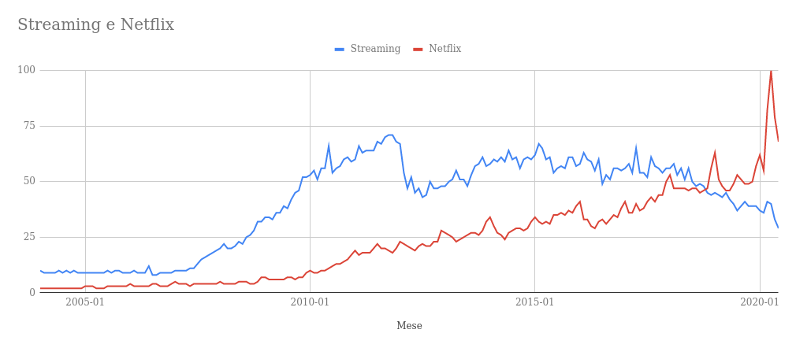

# Traccia

L'ultimo decennio è caratterizzato della diffusione di nuovi servizi digitali a disposizione dell'utente, è quindi inevitabile che la pirateria ha dovuto modificare le proprie strategie; lo studente descriva dettagliatamente il fenomeno, quali tecniche e architetture si possono utilizzare per contrastare il fenomeno.

## Obiettivo

Descrivere il fenomeno della pirateria, tecniche e architetture per contrastarla

# La nuova contraffazione dei dati

## Possibile scaletta

<ol>
	<li>Definizione di pirateria</li>
	<li>Crescita dei servizi e nascita del fenomeno</li>
	<li>Motivazioni dietro la nascita della pirateria</li>
	<li>Il nuovo petrolio del 21esmio secolo</li>
	<li>Fra pirati non c'è onore</li>
	<li>Per sconfiggere un pirata</li>
</ol>

### Definizione di pirateria

Si potrebbe pensare che lo scopo di piratare prodotti informatici è quello di condividere software e reperti multimediali gratuitamente, è quindi facile pensare che la pirateria sia in qualche modo affiliata al pensiero del software libero ma non è assolutamente così [1].

Il software libero viene rilasciato con l'intento di essere condiviso a titolo gratuito con lo scopo di trasmettere cultura e aumentare la cooperazione tra le persone [2] mentre la pirateria informatica ha scopi di natura lucrativa. La definizione più generica di pirateria è quella di "varie attività di natura illecita perpetrate tramite l'utilizzo di strumenti informatici, in violazione delle norme giuridiche di uno Stato" [3].

Questa definizione, seppur corretta, non descrive al meglio la pirateria informatica e l'aspetto che ha assunto negli ultimi tempi. La pirateria non è più un taboo digitale, non riguarda più le attività criminose gravi quali attacchi informatici a corporazioni o furto di proprietà intellettuale, ora la pirateria ricade in una zona grigia dell'ambito legale in quanto più o meno tutti gli internauti si sono resi pirati.

I termini più comunemente associati, come "video streaming" o "programmi craccati" ci possono orientare verso una definizione diversa: "la pirateria è l'insieme di tutte le attività mirate alla contraffazione o alla distribuzione illecita di prodotti presenti in rete protetti da copyright e forniti al pubblico dietro una forma di pagamento"

- [1 Linux didattica sulla pirateria](http://linuxdidattica.org/docs/linuxmagazine/bernardi_25.html)
- [2 Filosofia del software libero - Wikipedia](https://it.wikipedia.org/wiki/Software_libero#Aspetti_filosofici_e_sociali)
- [3 Pirateria informatica - Wikipedia](https://it.wikipedia.org/wiki/Pirateria_informatica)

### Crescita dei servizi e nascita del fenomeno

Il fenomeno della pirateria nasce con la progressiva diffusione dell'home computer, nient'altro che un mezzo utilizzato per ottenere un fine, lecito o illecito. Inizia ad essere usato per aggirare sistemi e ottenere dati e/o informazioni solitamente protetti e esclusi dal dominio pubblico.

Queste informazioni sono per esempio, documenti legali, file protetti da copyright, informazioni su persone, credenziali di accesso ad un sistema e altri tipi di dati [3].

Le tecniche per raggiungere questi scopi col tempo si sono diversificate sempre più, alcune, avvicinandosi anche ad attaccare le "vulnerabilità psicologiche" dell'utente umano, allo stesso tempo conservando la loro natura di attacchi informatici fatti di programmi con comportamenti predeterminati da chi li crea.

Ma la pirateria informatica (come la intendiamo noi) non ha come intento quello di creare disservizio o danneggiare proprietà, piuttosto quello evitare di dover pagare per servirsi di servizi web e/o usufruire di software distribuiti sotto licenza.

### Motivazioni dietro la pirateria

Nella pirateria informatica mancano le motivazioni di alto tasso morale che ci sono negli altri movimenti che mirano a distribuire il software gratuitamente, essa è nata con lo scopo di rivendere software proprietari a prezzi al ribasso.

Col tempo, e con l'avvento di software come eMule e uTorrent, la creazione di reti peer-to-peer è diventata sempre più facile (anche per utenti inesperti) e ciò ha comportato un pesante incremento del bacino di utenza capace di condividere file e programmi senza doversi confrontare con la dura realtà di creare manualmente di una rete di scambio dati.

Più il numero di utenti aumentava e più la pirateria si allontanava dallo scopo di lucro originario in favore di un altra valuta che col tempo sarebbe diventata sempre più preziosa: **i dati**.

### Il nuovo petrolio del 21esmio secolo

> Il più semplice scolaro sa oggi verità per le quali Archimede avrebbe sacrificato la vita **Ernest Renan**, *Ricordi d'infanzia e di giovinezza*

Prendiamo ad esempio le app per mobile: se la maggior parte delle app presenti sul Play Store sono gratuite, come fanno queste a generare introiti?

La risposta è collezionando dati (come informazioni sul calendario, log delle chiamate, posizione del dispositivo, cronologia del browser...) in modo da poterli rivendere [4].

Una volta che questi dati vengono raggruppati in un dataset prendono il nome di Big Data. Ognuno di questi dataset è caratterizzato da tre caratteristiche, dette le "3V":

- **Volume**: quantità di dati e dimensione del dataset (GB,TB,PB...)
- **Varietà**: differenti tipologie di dati utilizzati, spesso eterogenei perché provengono da device diversi e trattano informazioni differenti (dati non strutturati e semi-strutturati)
- **Velocità**: velocità con cui i nuovi dati vengono generati e rapidità dei dati nell'essere inseriti in un sistema real-time

Secondo una stima, nel 2014 sono stati generati 650 Exabyte (650 miliardi di GB) di dati risultati dal traffico di dati in internet [5].

Una dimensione simile di dati è difficile da ammassare ed è ancora più difficile da analizzare perché le informazioni provengono da innumerevoli fonti e si presentano in formati diversi, la difficoltà nel trattare questo tipo di dati è quella di ricercare un nesso che lega i dati fra di loro e che rappresenti gli "umori" del mercato e che dia un senso a tutte le informazioni che transitano attraverso internet [6].

6 minuti

### Per sconfiggere un pirata

Ora che sappiamo quali sono le tecnologie coinvolte, come facciamo a combattere la pirateria?

Per loro natura, le reti P2P che usano il protocollo BitTorrent per condividere file non dispongono di una figura centrale che serve il resto dei client, quindi avere una sola fonte di log è impossibile.

Per poter utilizzare i big data a nostro favore e individuare il traffico dei nostri attori malevoli bisogna disporre di due cose:

<ol>
	<li>Un server tracker</li>
	<li>Un sistema informativo per analizzare i dati</li>
</ol>

#### 1 - Il server tracker

Questa macchina si occupa di coordinare i rapporti tra utenti richiedenti un file e quelli che lo offrono, ha lo scopo di localizzare le altre sorgenti che possiedono il file o parte di esso.

Ogni richiedente effettua una richiesta al nostro server tracker il quale tiene traccia di tutte le informazioni contenute nelle richieste che riceve (in particolare l'IP) del richiedente e degli altri server tracker che vengono interpellati. [8]

Ma siccome non tutto quello che passa in una rete P2P BitTorrent è materiale illegale bisogna costruire un database che possa tenere traccia di quali sorgenti sono affidabili e quali no.

#### 2 - Il sistema informativo

Quando si progetta un database che deve gestire così tanti dati, percorrere la strada dei Database Relazionali potrebbe non essere l'opzione migliore.

L'obiettivo primario è rispettare le proprietà basilari di un DB che deve essere:

- semplice
- efficiente
- efficace
- sicuro

Per farlo si utilizzano spesso parallelamente sia i database relazionali e i non-relazionali: la differenza principale tra le due è che nel primo, viene usato il linguaggio per query strutturate SQL con le sue componenti DML e DDL, mentre nei database non-relazionali non viene definita una struttura a priori, bensì essa viene creata via via con l'inserimento dei dati sotto forma di documenti JSON, infatti il nome con cui è conosciuta questa tecnologia è proprio NoSQL, Not Only SQL.

#### Fallimento del SOPA e altri metodi

Per combattere questo sistema negli anni sono stati adottai tantissimi sistemi, diversi tra loro. Un esempio è la casa videoludica Rockstar Games che ha incorporato un sistema anti-pirateria nel loro videogioco GTA IV il quale si attivava solo sulle copie che non disponevano di una chiave di attivazione valida modificando alcune impostazioni e rendendo l’intero prodotto ingiocabile.

Un altro metodo che è stato adottato è quello del SOPA, il Stop Online Piracy Act, una legge promossa dal partito democratico statunitense USA all'inizio del 2012 (ciò che ha causato quella diminuzione nella ricerca del termine streaming nel gennaio 2012) ma mai entrata in vigore. Questa legge fu soggetta a molte controversie in quanto molti esponenti del pensiero del software libero come il co-fondatore di Wikipedia, Jimmy Wales, sostenevano che questo tipo di provvedimento sarebbe stato un ostacolo al primo emendamento e una censura della libertà di parola in quanto alcuni dettagli tecnici di questo decreto sembravano puntare verso una "privatizzazione" di certi settori di internet.

### La nuova frontiera della pirateria

- [4 Come le app generano revenue](https://www.consumer.ftc.gov/articles/0018-understanding-mobile-apps)
- [5 Quantità di  dati generati](https://science.sciencemag.org/content/332/6025/60)
- [6 Big Data](https://it.wikipedia.org/wiki/Big_data)
- [7 SOPA (inizio 2012)](https://www.youtube.com/watch?v=5X7GwsIERbo)
- [8 BitTorrent Specification](https://wiki.theory.org/index.php/BitTorrentSpecification)

### Consiglio prof

Sistemi: log
informatica: inserire i log nei databse non relazionali o relazionali

collegamento con pcto: come ho fatto log durante l'alternanza e quali sono stati i rischi dei software contraffatti

Ogni attività viene monitorata, big data, (database con modello a oggetti, database reticolari)

https://lorenzogovoni.com/database-relazionali-e-big-data/
https://www.rackone.it/big-data-con-database-nosql-unintroduzione-pratica/

https://it.wikipedia.org/wiki/%CE%9CTorrent
https://it.wikipedia.org/wiki/EMule
https://it.wikipedia.org/wiki/Peer-to-peer
https://it.wikipedia.org/wiki/Stop_Online_Piracy_Act#Contenuto_della_proposta_legislativa
https://techpost.bsa.org/2015/04/23/malware-threats-from-unlicensed-software-the-critical-first-step-for-cyberrisk-management/?utm_source=feedburner&utm_medium=feed&utm_campaign=Feed%3A+BSATechpost+%28BSA+TechPost%29

